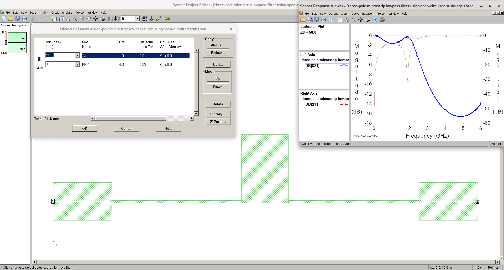

# low_pass_filter
A microstrip low-pass filter implemented in [SonnetLite](http://www.sonnetsoftware.com/products/lite/)

Filter design is fine-tuned from chapter 5 of book 'Jia-Sheng Hong - Microstrip Filters for RF Microwave Applications, 2nd Edition (Wiley Series in Microwave and Optical Engineering)   (2011, Wiley)'

Credit: Edaboard and eevblog forums provide help in EM simulation

TODO : 
1. Actual PCB fabrication and S-Parameter testing using Vector Network Analyzer
2. [Prove the microstrip filter design math equations](https://www.eevblog.com/forum/rf-microwave/microstrip-high-and-low-impedance-short-line-sections/)
